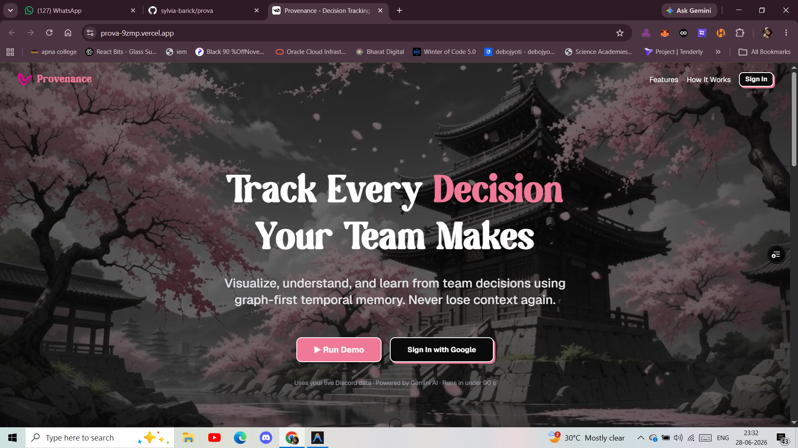
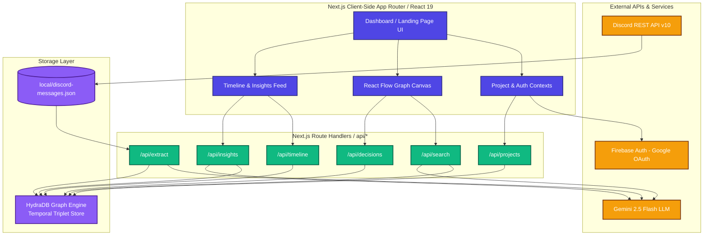
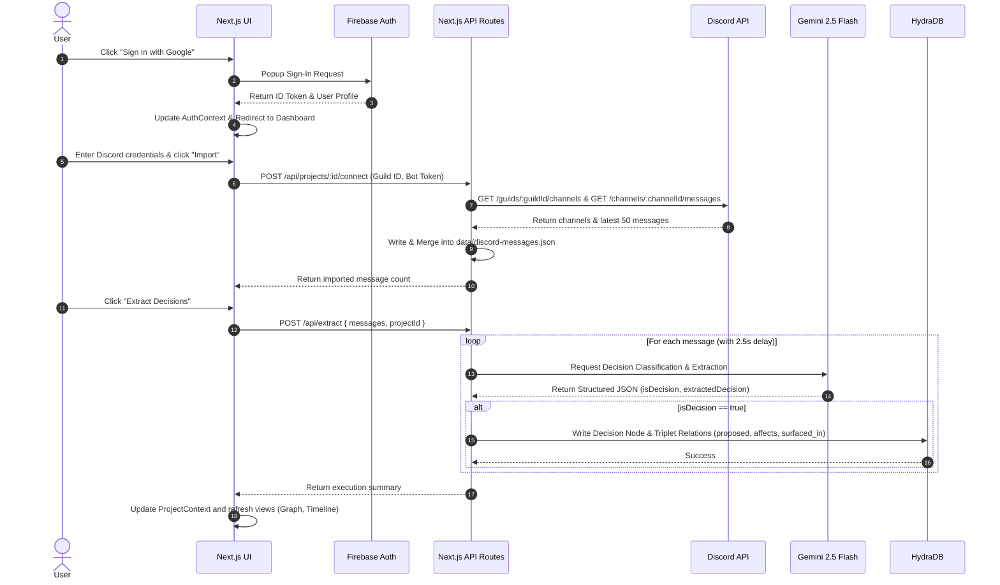
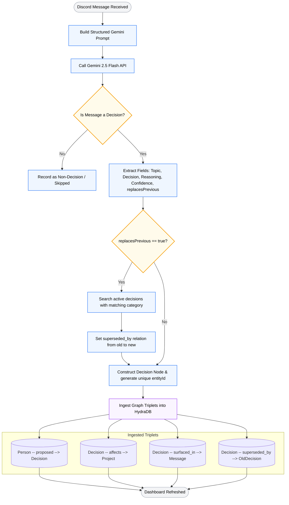
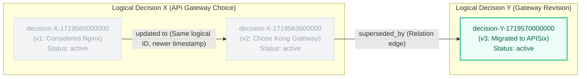
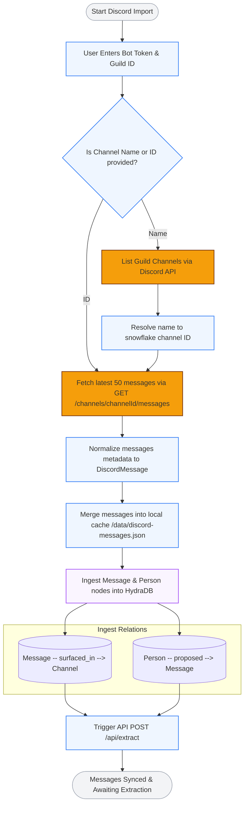
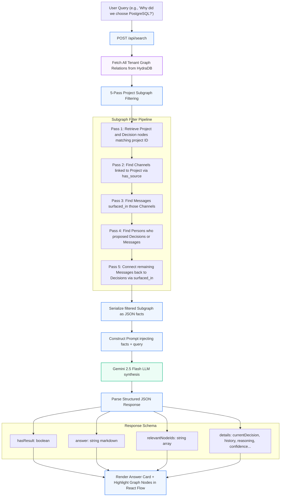
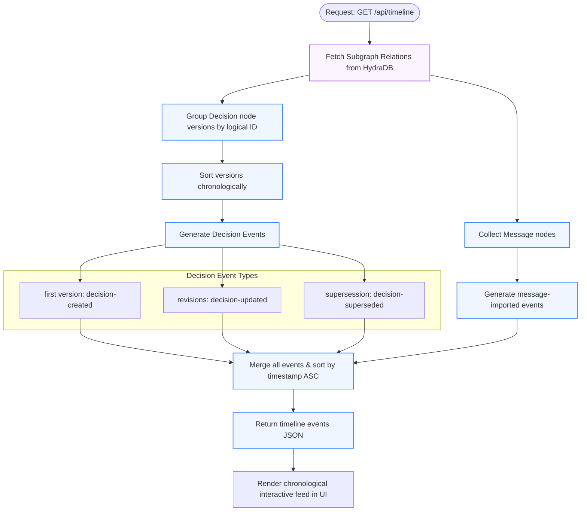
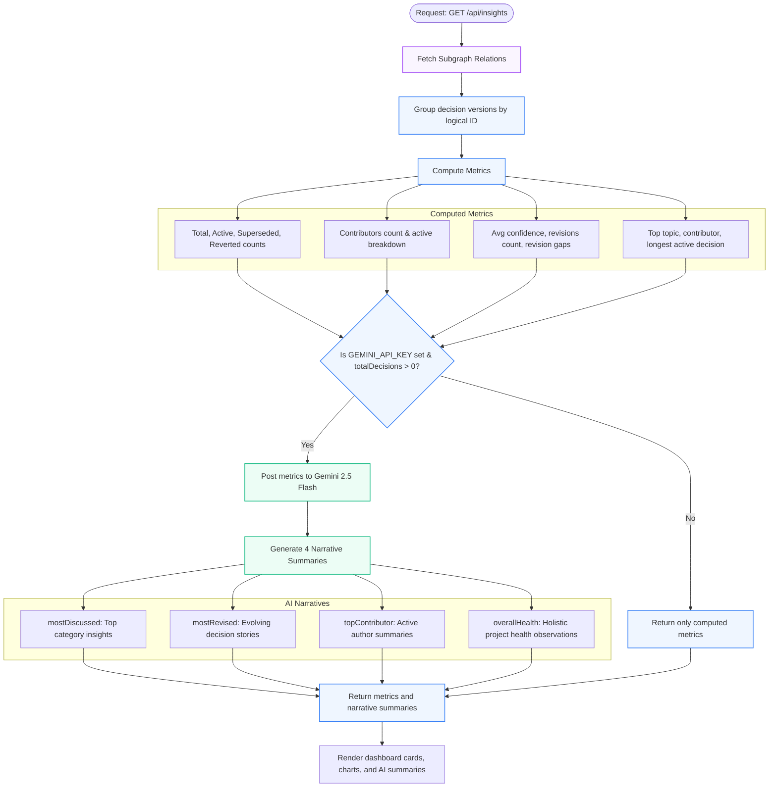
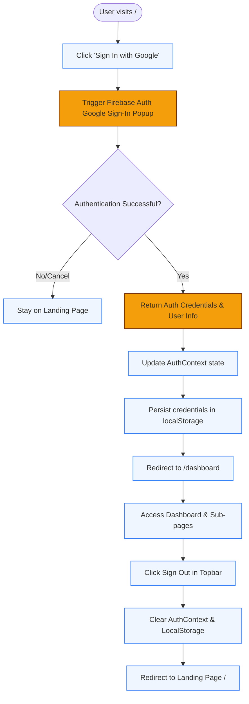

<div align="center">

# Provenance
  

<br />

### Track every decision your team makes.

Visualize, understand, and learn from team decisions using graph-first temporal memory.  
*Never lose context again.*

[](https://nextjs.org)
[](https://www.typescriptlang.org)
[](https://firebase.google.com)
[](https://hydradb.io)
[](https://ai.google.dev)

</div>

---

## What is Provenance?

Provenance is a **graph-native decision intelligence platform** for software teams. It connects to
your communication platforms (starting with Discord), uses **Gemini AI** to automatically extract
and classify decisions from conversations, stores them in a **temporal knowledge graph** via
HydraDB, and surfaces them through an interactive dashboard featuring:

- **Semantic Search** — Ask questions in natural language about any decision
- **Graph Visualization** — See how decisions relate to people, channels, and each other
- **Timeline** — Chronologically trace every decision event in a project
- **Insights** — AI-generated summaries of team decision patterns
- **Graph Versioning** — Decisions are never overwritten; every revision is preserved

---

## The Problem & The Solution

### The Problem: Knowledge Decay in Modern Software Teams
In fast-moving engineering teams, decisions are made continuously across multiple channels—chat rooms (Discord, Slack), pull request threads, design docs, and sync meetings. Over time, this leads to:
1. **Context Loss**: A decision is agreed upon in a chat thread, but six months later, nobody remembers *why* it was made.
2. **Outdated Wikis**: Static documentation like Confluence or Notion pages quickly become stale and out-of-sync with active decisions.
3. **Knowledge Fragmentation**: Key structural choices are buried under thousands of casual chat messages.
4. **Tracking Gap**: Traditional databases overwrite old states, making it impossible to audit how a decision evolved over time.

### The Solution: Graph-Native Temporal Decision Memory
Provenance solves these problems by treating decisions as **first-class temporal graph entities**. 

| Aspect | Traditional Documentation (Wikis/Chat logs) | Provenance (Graph-Native Temporal AI Memory) |
| :--- | :--- | :--- |
| **Extraction** | Manual entry required (high friction, often forgotten) | **Automated AI Extraction** (Gemini parses chats automatically) |
| **Structure** | Flat files, unstructured text, or search-heavy chat history | **Typed Knowledge Graph** (Entities & typed relations in HydraDB) |
| **History & Auditing** | Overwritten states (loss of history) or hard-to-trace wiki edits | **Temporal Versioning** (Every revision saved with timestamps & supersession links) |
| **Searchability** | Keyword matching (returns irrelevant files/chats) | **Semantic Graph Search** (AI answers queries using actual graph subgraphs) |
| **Traceability** | Isolated messages with no connection to who proposed what | **Explicit Relations** (`proposed`, `affects`, `superseded_by`, `surfaced_in`) |

---

###  Project Links

-  **[Live Demo Website](https://prova-9zmp.vercel.app/)** 
-  **[Google Drive Walkthrough Video](https://drive.google.com/drive/folders/1TcWYSaRdkRTnYJ0tjvvEDO_ZhrPtgFeQ)** 


---

## System Architecture

### Diagram

```
                        +------------------------------------+
                        |       Next.js 16 Frontend          |
                        |  (App Router -- React 19, TSX)     |
                        +----------------+-------------------+
                                         |
                            REST API Routes  (app/api/*)
                                         |
              +--------------------------|---------------------------+
              |                          |                           |
        Firebase Auth           Project / Discord             AI Extraction
        (Google OAuth)           API Handlers                (Gemini 2.5 Flash)
              |                          |                           |
              +--------------------------+---------------------------+
                                         |
                              HydraDB Graph Engine
                           (Temporal Knowledge Graph)
                                         |
          +------------------------------|------------------------------+
          |                              |                              |
   Discord Import                  Graph Queries                 Search Queries
   (Bot Token API)                 (Triplet relations)           (Subgraph extraction)
          |                              |                              |
          +---------------+-------------+--------------+---------------+
                          |                             |
                   React Flow Graph             Gemini Synthesis
                   (Interactive)               (Answers + Summaries)
                          |                             |
                          +-------------+---------------+
                                        |
                                 Dashboard UI
                          +-------------|-------------+
                          |             |             |
                       Timeline     Insights       Search
```

### Architecture Flowchart 



### Component Explanations

| Component | Role |
|---|---|
| **Next.js 16 App Router** | Full-stack framework powering both the UI and the backend API routes. Uses React 19 with server and client component split. |
| **Firebase Auth (Google OAuth)** | Handles user authentication via Google Sign-In popup. Sessions are persisted client-side through `AuthContext` which subscribes to `onAuthStateChanged`. |
| **HydraDB Graph Engine** | Stores all entities (Projects, Decisions, Persons, Messages, Channels) as typed graph triplets. Acts as the single source of truth for the entire system. |
| **Gemini 2.5 Flash** | Google's LLM used for: (1) classifying and extracting decisions from Discord messages, (2) synthesizing natural-language search answers, and (3) generating insight summaries. |
| **Discord Bot Integration** | Uses a Discord Bot Token to call the Discord REST API v10 and fetch messages from a configured channel. Messages are stored locally and ingested into HydraDB. |
| **React Flow (`@xyflow/react`)** | Powers the interactive graph visualization. Renders Decision, Person, and Channel nodes with typed directional edges. Supports search-driven node highlighting. |
| **Project Context** | A React context layer (`ProjectContext`) that caches project data and decisions client-side, reducing redundant API calls across dashboard views. |

---

## Complete Workflow

```
User visits landing page
         |
         v
  Google Sign-In  (Firebase Auth)
         |
         v
  Redirected to Dashboard
         |
         v
  Create or open an existing Project
         |
         v
  Connect Discord  (Bot Token + Guild ID + Channel Name/ID)
         |
         v
  Import Messages  (up to 50 messages via Discord v10 API)
         |
         v
  POST /api/extract -- Gemini analyzes each message
         |
         +-- Non-decision messages --> skipped
         |
         +-- Decision/Reversal messages -->
                    |
                    v
              Decision node created in HydraDB
              + proposed / affects / superseded_by / surfaced_in relations
                    |
                    v
  Dashboard reflects updated project decision count
         |
         v
  +------------------------------------------+
  |             Explore Project              |
  |                                          |
  |  Graph    ---- React Flow map            |
  |  Timeline ---- Chronological event feed  |
  |  Search   ---- Natural-language Q&A      |
  |  Insights ---- AI-generated analytics   |
  +------------------------------------------+
```

### Workflow Sequence Diagram



### Workflow Details Matrix

| Workflow | Trigger | Input Data | Core Components | Services / AI | UI Output |
| :--- | :--- | :--- | :--- | :--- | :--- |
| **Authentication** | Click "Sign In with Google" | User Google account credentials | [AuthContext.tsx](file:///d:/hydra/PROVENANCE/context/AuthContext.tsx), `components/auth` | Firebase Authentication | User profile, redirection to `/dashboard` |
| **Project Setup** | Click "Create Project" | Project Name, Description | [route.ts](file:///d:/hydra/PROVENANCE/app/api/projects/route.ts), [ProjectContext.tsx](file:///d:/hydra/PROVENANCE/context/ProjectContext.tsx) | HydraDB (Project node) | Project card in list, redirect to project home |
| **Discord Connection** | Save credentials on Connect tab | Bot Token, Guild ID, Channel ID/Name | `/connect` page, [discord.ts](file:///d:/hydra/PROVENANCE/lib/discord.ts) | Discord API v10 | Channel connection confirmation & sync status |
| **Message Sync** | Click "Import Messages" | Connected channel metadata | [route.ts](file:///d:/hydra/PROVENANCE/app/api/discord/messages/route.ts) | Discord API v10, [discord-messages.json](file:///d:/hydra/PROVENANCE/data/discord-messages.json) | Preview list of imported message cards |
| **Decision Extraction** | Click "Extract Decisions" | List of imported Discord messages | [route.ts](file:///d:/hydra/PROVENANCE/app/api/extract/route.ts), [discord.ts](file:///d:/hydra/PROVENANCE/lib/discord.ts) | Gemini 2.5 Flash, HydraDB | Extraction report, incremented project decision counts |
| **Graph Visualization**| Open Graph tab | Project ID | [route.ts](file:///d:/hydra/PROVENANCE/app/api/graph/route.ts), `@xyflow/react` | HydraDB (Relations query) | Draggable & zoomable interactive node-edge graph |
| **Semantic Search** | Submit natural-language question | Search query text | [route.ts](file:///d:/hydra/PROVENANCE/app/api/search/route.ts), [hydradb.ts](file:///d:/hydra/PROVENANCE/lib/hydradb.ts) | Gemini 2.5 Flash (Subgraph synthesis), HydraDB | AI answer card, highlighted graph nodes, timeline events |
| **Timeline Reconstruct**| Open Timeline tab | Project ID | [route.ts](file:///d:/hydra/PROVENANCE/app/api/timeline/route.ts), [ProjectContext.tsx](file:///d:/hydra/PROVENANCE/context/ProjectContext.tsx) | HydraDB (Temporal queries) | Chronological feed with icons, diffs, and Discord previews |
| **Insights & Analytics**| Open Insights tab | Project ID | [route.ts](file:///d:/hydra/PROVENANCE/app/api/insights/route.ts) | HydraDB, Gemini 2.5 Flash (Narrative synthesis) | Hard metrics cards, breakdown charts, AI summaries |

**Step-by-step explanation:**

1. **User Login** — Firebase Google OAuth popup. On success the user is stored in `AuthContext` and redirected to `/dashboard`.
2. **Create/Open Project** — Projects are created via `POST /api/projects` and stored as `Project` nodes in HydraDB. All projects are listed via `GET /api/projects`.
3. **Connect Discord** — The user provides a Bot Token, Guild ID, and channel name or ID on the `/connect` page.
4. **Import Messages** — The backend fetches the latest 50 messages from the specified Discord channel via the Discord REST API.
5. **Gemini Extracts Decisions** — Each message is sent to Gemini 2.5 Flash. Gemini classifies the message and, when it is a decision, returns a structured JSON object.
6. **HydraDB Stores Graph** — The decision, its author, and the source message are ingested as graph entities with typed relationships (`proposed`, `affects`, `superseded_by`, `surfaced_in`).
7. **Dashboard Updates** — The project decision count increments as the `affects` relation links each new decision to the project.
8. **Graph Visualization** — All relations are fetched via `GET /api/graph` and rendered by React Flow.
9. **Timeline Generation** — `GET /api/timeline?projectId=` reconstructs all chronological events by grouping decision node versions.
10. **Semantic Search** — `POST /api/search` extracts a project-scoped subgraph, sends it to Gemini, and returns a structured answer with node IDs for graph highlighting.
11. **Insights Generation** — `GET /api/insights?projectId=` computes hard metrics from the graph and asks Gemini to produce four narrative summaries.

---

## AI Decision Extraction Pipeline

### Pipeline Diagram

```
Discord Message  (author, timestamp, content)
         |
         v
Structured Gemini Prompt is built
(classification types + JSON schema injected)
         |
         v
Gemini 2.5 Flash API call
(responseMimeType: application/json)
         |
         v
Classification:
  Decision / Proposal / Discussion / Reversal / Question / Other
         |
         +-- isDecision = false --> skip, record as non-decision
         |
         +-- isDecision = true
                    |
                    v
            Decision Extraction:
            - decision       (full description)
            - topic          (affected system or module)
            - reasoning      (justification or context)
            - confidenceScore  (0.0 to 1.0)
            - replacesPrevious (boolean)
            - previousDecisionTopic  (string, if applicable)
                    |
                    v
         Supersession Detection:
         Searches existing project decisions for a
         matching category or title to build supersedes[]
                    |
                    v
         Decision entity constructed and
         persisted via hydraDB.createDecision()
                    |
                    v
         Graph triplets ingested into HydraDB:
         - Person    --> proposed    --> Decision
         - Decision  --> affects     --> Project
         - Decision  --> superseded_by --> OldDecision  (if applicable)
         - Decision  --> surfaced_in --> Message
```

### Extraction Pipeline Flowchart 



### Example Gemini JSON Response

```json
{
  "classification": "Decision",
  "isDecision": true,
  "extractedDecision": {
    "decision": "We are switching from REST to GraphQL for all internal service communication going forward.",
    "topic": "API Architecture",
    "reasoning": "REST endpoints are becoming hard to maintain as consumer count grows. GraphQL removes over/under-fetching.",
    "confidenceScore": 0.92,
    "replacesPrevious": true,
    "previousDecisionTopic": "REST API"
  }
}
```

After extraction the system persists this `Decision` node:

```json
{
  "id": "decision-1234567890",
  "projectId": "proj-abc",
  "title": "API Architecture: We are switching from REST to GraphQL",
  "description": "We are switching from REST to GraphQL for all internal service communication going forward.",
  "author": { "id": "discord-user-id", "name": "alice", "role": "Contributor" },
  "status": "active",
  "category": "API Architecture",
  "supersedes": ["decision-prev-rest-id"],
  "impact": "high",
  "tags": ["api architecture"],
  "timeline": {
    "created": "2026-06-28T10:00:00.000Z",
    "updated": "2026-06-28T10:00:00.000Z"
  }
}
```

> A 2.5-second delay is applied between each Gemini call to respect API rate limits.

---

## HydraDB Data Model

HydraDB stores all data as a **graph of typed entities and typed relationships**. Every entity has:

| Field | Description |
|---|---|
| `entityId` | Unique identifier, e.g. `decision-xyz-1234567890` |
| `name` | Human-readable label |
| `type` | Entity type string |
| `identifier` | Compact JSON blob of the entity's properties |
| `namespace` | Always `"provenance"` |

### Node Types

#### Project

Represents a team's workspace.

| Field | Description |
|---|---|
| `id` | Unique project UUID |
| `name` | Display name (max 30 chars in storage) |
| `description` | Short project description |
| `slug` | URL-safe identifier |
| `createdAt` | ISO date string |

**EntityId format:** `project-{id}`

---

#### Person

Represents a user — a Discord author, team member, or project owner.

| Field | Description |
|---|---|
| `id` | Discord user ID or Firebase UID |
| `name` | Display name |
| `email` | Email address (may be empty for Discord-only users) |
| `avatar` | Avatar URL |
| `role` | Freeform role string, e.g. `"Contributor"` |

**EntityId format:** `person-{id}`

---

#### Decision

The core entity. Multiple versions of the same decision (same logical `id`) are stored as separate
graph nodes distinguished by their timestamp suffix.

| Field | Description |
|---|---|
| `id` | Logical decision ID — stable across revisions |
| `projectId` | Parent project ID |
| `title` | `"{topic}: {first sentence}"` |
| `description` | Full decision text |
| `author` | Embedded Person reference |
| `status` | `"active"` / `"superseded"` / `"reverted"` |
| `category` | Topic or system affected |
| `supersedes` | Array of decision IDs this one replaces |
| `supersededBy` | Array of decision IDs that replaced this one |
| `affects` | Modules or files impacted |
| `impact` | `"high"` / `"medium"` / `"low"` — derived from confidence score |
| `tags` | Lowercase tag array |
| `timeline.created` | When the original Discord message was sent |
| `timeline.updated` | When this version of the node was written |

**EntityId format:** `decision-{id}-{updated_timestamp_ms}`

---

#### Message

Represents a raw Discord message that was imported and analyzed.

| Field | Description |
|---|---|
| `id` | Discord message snowflake ID |
| `author.id` | Discord user ID |
| `author.username` | Discord username |
| `content` | Message text (first 30 chars in storage) |
| `timestamp` | ISO timestamp of the original message |
| `channelId` | Discord channel ID |

**EntityId format:** `message-{id}`

---

#### Channel

Represents a connected data source — currently Discord channels.

| Field | Description |
|---|---|
| `id` | Channel ID (Discord snowflake or name) |
| `type` | `"discord"` / `"github"` / `"slack"` |
| `name` | Human-readable channel name |
| `connected` | Whether the source is active |
| `lastSync` | ISO timestamp of last successful import |
| `config` | Freeform config bag |

**EntityId format:** `channel-{id}`

---

### Relationship Types

| Predicate | Source --> Target | Meaning |
|---|---|---|
| `proposed` | Person --> Decision | The person authored this decision |
| `proposed` | Person --> Message | The person sent this Discord message |
| `surfaced_in` | Decision --> Message | This decision was extracted from this message |
| `surfaced_in` | Message --> Channel | This message came from this channel |
| `affects` | Decision --> Project | This decision belongs to this project |
| `superseded_by` | Decision --> Decision | The older decision was replaced by the newer one |
| `member_of` | Person --> Project | Team membership |
| `has_source` | Project --> Channel | Connected integration |
| `self` | Project --> Project | Bootstrapping triplet when a project has no other relations |

---

### Temporal Versioning

Each time a decision is updated or re-extracted, a **new graph entity** is created with a new
`entityId` that appends the current timestamp in milliseconds. The old entity is never deleted.

The service layer (`hydradb.ts -- fetchFromGraph()`) resolves the latest version by:

1. Collecting all `Decision` nodes with the same logical `id` field
2. Selecting the one with the highest `timeline.updated` timestamp

The graph therefore holds the **complete revision history**, enabling timeline replay and full
supersession chain traversal.

---

## Graph Versioning

### Supersession Chain

```
Decision A  (status: active)
       |
       |  superseded_by
       v
Decision B  (status: active)
       |
       |  superseded_by
       v
Decision C  (status: active)  <-- current version
```

### Graph Versioning & Supersession Chain



### Why Previous Versions Are Never Overwritten

Provenance treats **decisions as immutable events**. When a new decision replaces an older one:

1. The **old Decision node is kept** in the graph with its original `entityId` and timestamp.
2. A **new Decision node** is created with a fresh `entityId` (current timestamp appended).
3. A `superseded_by` edge connects the old node to the new one.

This design provides:

- **Auditability** — You can always trace why a decision changed and when.
- **Timeline accuracy** — The timeline API reconstructs all version events from graph history.
- **No data loss** — Reverting a decision does not erase what was previously agreed upon.
- **Full queryability** — Gemini can answer "what was the original decision about X?" because both old and new nodes exist.

---

## Discord Import Workflow

```
Discord Server  (guild)
       |
       |  User supplies Bot Token + Guild ID + Channel Name/ID
       v
  Channel Resolution
  (channel name is resolved to a snowflake ID via
   GET /guilds/{guildId}/channels)
       |
       v
  Discord REST API v10
  GET /channels/{channelId}/messages?limit=50
       |
       v
  Messages normalized to DiscordMessage[]
  { id, author { id, username, avatar }, content, timestamp, channelId }
       |
       v
  Saved to  data/discord-messages.json
  (merged with previous imports by message ID)
       |
       v
  Ingested into HydraDB as graph triplets:
    Message --> surfaced_in --> Channel
    Person  --> proposed    --> Message
       |
       v
  POST /api/extract  { messages, projectId }
       |
       v
  Gemini analyzes each message  (2.5 s delay between calls)
       |
       +-- Non-decision --> recorded as skipped
       +-- Decision extracted -->
              Decision node + relations written to HydraDB
       |
       v
  Dashboard decision count updates
```

### Ingestion Flowchart 



| Step | What happens |
|---|---|
| **Bot Token** | Used in `Authorization: Bot <token>` on all Discord API calls. The bot must have the `MESSAGE_CONTENT` privileged intent enabled in the Discord Developer Portal. |
| **Channel Resolution** | If a channel name is supplied (e.g. `"general"`), the backend lists all guild channels and resolves the name to a snowflake ID. Numeric IDs are passed through directly. |
| **Message Fetch** | Up to 50 messages are fetched per request — the Discord API pagination maximum. |
| **Local Cache** | Messages are merged with `data/discord-messages.json` by ID to prevent duplicates on re-import. |
| **HydraDB Ingest** | Each message is stored as a `Message` node linked to its `Channel` via `surfaced_in` and to its author `Person` via `proposed`. |
| **Extraction** | Each message is sent to Gemini with a 2.5-second delay to stay within rate limits. |
| **Dashboard Update** | Each new decision's `affects` relation increments the project decision count. |

---

## Semantic Search Workflow

```
User types a question  (Search page)
       |
       v
POST /api/search  { query, projectId }
       |
       v
Fetch all graph relations from HydraDB
client.context.relations({ tenantId })
       |
       v
5-pass project-scoped subgraph extraction:
  Pass 1 -- Projects + Decisions matching projectId
  Pass 2 -- Channels connected via has_source
  Pass 3 -- Messages surfaced_in those Channels
  Pass 4 -- Persons who proposed Decisions or Messages
  Pass 5 -- Remaining Messages linked via surfaced_in
       |
       v
Filtered subgraph serialized as JSON
(source, target, relations with predicates)
       |
       v
Gemini 2.5 Flash prompt:
  "Answer using ONLY the graph facts.
   Return: hasResult, answer, relevantNodeIds, details { ... }"
       |
       v
Gemini returns structured JSON
       |
       v
UI renders answer card
+ Graph highlights relevantNodeIds
+ Timeline surfaces matching decision events
```

### Graph-Native Search & Synthesis Flow 



### How Graph Relationships Improve Search

Standard keyword search finds text matches. Provenance's graph-native search goes further:

- **Supersession chains** — Gemini traces the full evolution of a decision through `superseded_by` edges, explaining not just what the current decision is but how it got there.
- **People context** — The `proposed` relationship lets Gemini identify who made a decision, not just what it says.
- **Source tracing** — The `surfaced_in` relationship links decisions back to their original Discord messages so Gemini can quote the exact conversation.
- **Project scoping** — The 5-pass subgraph extraction sends only nodes belonging to the queried project to Gemini, keeping answers accurate and token-efficient.

---

## Graph Visualization Workflow

```
User opens Graph page
       |
       v
GET /api/graph
Returns all relations from HydraDB
       |
       v
Client parses triplets:
  Nodes -- Decision, Person, Channel, Message
  Edges -- typed relationship edges
       |
       v
React Flow renders:
  - Nodes as draggable cards
  - Edges as directional labeled arrows
       |
       v
User interactions:
  - Drag to re-layout
  - Click node to inspect
  - Run Search --> relevant nodes highlighted, others dimmed
```

### Node Types

| Node Type | What it shows |
|---|---|
| **Decision** | Title, status badge (active / superseded / reverted), category, impact level |
| **Person** | Discord username and role |
| **Channel** | Channel name, type, last sync time |
| **Message** | Truncated message content and author |

### Edge Types

| Edge | Direction | Meaning |
|---|---|---|
| `proposed` | Person --> Decision | Person authored the decision |
| `proposed` | Person --> Message | Person sent the message |
| `superseded_by` | Decision --> Decision | Source decision was replaced by target |
| `affects` | Decision --> Project | Decision belongs to this project |
| `surfaced_in` | Decision --> Message | Decision was extracted from this message |
| `surfaced_in` | Message --> Channel | Message came from this channel |
| `member_of` | Person --> Project | Team membership |
| `has_source` | Project --> Channel | Connected integration |

### Highlighting

When a semantic search returns `relevantNodeIds`, those nodes receive a highlighted style. All
other nodes are dimmed. This creates a direct visual bridge between a natural-language answer and
the underlying graph structure.

---

## Timeline Workflow

```
User opens Timeline page
       |
       v
GET /api/timeline?projectId={id}
       |
       v
Fetch all graph relations from HydraDB
       |
       v
5-pass subgraph extraction  (same as Search)
       |
       v
Group Decision nodes by logical decision ID
Sort each group chronologically by updated timestamp
       |
       v
Generate events for each group:
  decision-created          (first version)
  ai-extraction-completed   (if surfaced from a Discord message)
  decision-updated          (each subsequent revision)
  decision-superseded       (if superseded_by a different decision)
       |
       v
Collect Message import events:
  message-imported          (one per Discord message)
       |
       v
Merge all events, sort oldest-first
       |
       v
Client renders chronological feed with event icons,
author avatars, decision details, Discord message previews
```

### Timeline Reconstruction Flowchart 



**Timeline Event Types:**

| Event Type | Trigger | Shows |
|---|---|---|
| `message-imported` | A Discord message was fetched | Author, channel, message content |
| `decision-created` | First version of a decision extracted | Title, author, original message |
| `ai-extraction-completed` | Gemini classified and extracted a decision | Gemini attribution, source Discord message |
| `decision-updated` | Subsequent version of the same decision created | Status diff or description diff |
| `decision-superseded` | A decision was replaced by a newer one | Both old and new decision titles |

---

## Insights Workflow

```
User opens Insights page
       |
       v
GET /api/insights?projectId={id}
       |
       v
Fetch all graph relations from HydraDB
       |
       v
5-pass subgraph extraction
       |
       v
Group all Decision node versions by logical ID
Sort each group chronologically
       |
       v
Compute metrics:
  totalDecisions           unique logical decision IDs
  activeDecisions          status === 'active'
  supersededDecisions      status === 'superseded'
  revertedDecisions        status === 'reverted'
  contributors             unique author IDs across decisions + messages
  importedMessages         count of Message nodes
  avgConfidence            mean of Gemini-assigned confidence scores
  avgRevisions             mean version count per logical decision
  avgRevisionGapHours      mean hours between consecutive revisions
  mostActiveContributor    author with highest version count
  mostDiscussedTopic       category with highest decisions + revisions
  mostRevisedDecision      decision with highest version count
  longestActiveDecision    oldest currently-active decision
  categoryBreakdown        per-category decision and revision counts
  contributorBreakdown     per-author version counts
       |
       v
If GEMINI_API_KEY configured and totalDecisions > 0:
  POST metrics to Gemini 2.5 Flash
  Generate four narrative summaries:
    mostDiscussed    about top category
    mostRevised      about most revised decision
    topContributor   about most active author
    overallHealth    project health observation
       |
       v
Return { metrics, summaries } to client
       |
       v
Dashboard renders metric cards + AI summaries + charts
```

### Insights Compilation Pipeline 



### Computed vs. AI-Generated Values

| Value | Source |
|---|---|
| `totalDecisions` | **Computed** — count of unique logical decision IDs |
| `activeDecisions` | **Computed** — filtered by status |
| `supersededDecisions` | **Computed** — filtered by status |
| `revertedDecisions` | **Computed** — filtered by status |
| `contributors` | **Computed** — unique author ID set |
| `importedMessages` | **Computed** — Message node count |
| `avgConfidence` | **Computed** — mean confidence score |
| `avgRevisions` | **Computed** — mean version count per decision |
| `mostActiveContributor` | **Computed** — max by version count |
| `mostDiscussedTopic` | **Computed** — max by decisions + revisions |
| `categoryBreakdown` | **Computed** — sorted array |
| `summaries.mostDiscussed` | **AI-generated** — Gemini narrative |
| `summaries.mostRevised` | **AI-generated** — Gemini narrative |
| `summaries.topContributor` | **AI-generated** — Gemini narrative |
| `summaries.overallHealth` | **AI-generated** — Gemini health observation |

> Gemini insight prompts instruct the model to use **only** the computed metrics and never fabricate data.

---

## Authentication Workflow

```
User visits landing page  (/)
       |
       v
Click "Sign In with Google" or "Run Demo"
       |
       v
Firebase Auth  signInWithPopup(auth, googleProvider)
Google OAuth 2.0 popup appears
       |
       v
Google authenticates the user
Firebase returns:  { uid, displayName, email, photoURL }
       |
       v
AuthContext stores user state  (onAuthStateChanged subscriber)
       |
       v
User redirected to /dashboard
       |
       v
Dashboard reads user from AuthContext
  null   --> redirect to /login
  found  --> show project list
       |
       v
All project sub-pages require an authenticated session
       |
       v
Sign out via top-bar
Firebase signOut() --> AuthContext clears --> redirect to /
```

### Authentication Flowchart 



Firebase persists the session in `localStorage` by default. The `AuthContext`
(`context/AuthContext.tsx`) wraps the app and subscribes to `onAuthStateChanged`, so the session
is restored on page refresh without requiring re-authentication.

---

## Folder Structure

```
PROVENANCE/
+-- app/                         Next.js App Router
|   +-- api/                     Backend API route handlers
|   |   +-- decisions/           Decision CRUD endpoints
|   |   +-- discord/
|   |   |   +-- messages/        GET /api/discord/messages
|   |   +-- extract/             POST /api/extract  (Gemini AI extraction)
|   |   +-- graph/               GET /api/graph  (HydraDB relations)
|   |   +-- insights/            GET /api/insights  (metrics + AI summaries)
|   |   +-- projects/            GET / POST /api/projects
|   |   +-- search/              POST /api/search  (semantic search)
|   |   +-- seed/                GET /api/seed  (first-sign-in project scaffold)
|   |   +-- timeline/            GET /api/timeline  (chronological events)
|   +-- dashboard/
|   |   +-- layout.tsx           Dashboard shell layout
|   |   +-- page.tsx             Project list overview
|   |   +-- projects/
|   |       +-- [id]/            Dynamic project pages
|   |           +-- page.tsx         Project home  (decisions list)
|   |           +-- connect/         Discord connection and import UI
|   |           +-- decisions/       Decision list and detail
|   |           +-- graph/           React Flow graph visualization
|   |           +-- insights/        Metrics and AI summaries
|   |           +-- reversed/        Reverted decisions view
|   |           +-- search/          Semantic search UI
|   |           +-- team/            Team members view
|   |           +-- timeline/        Chronological event timeline
|   +-- login/                   Standalone login page  (fallback)
|   +-- globals.css              Global CSS and design tokens
|   +-- layout.tsx               Root layout with context providers
|   +-- page.tsx                 Landing page  (hero, features, how-it-works)
|
+-- components/
|   +-- auth/                    Auth-related UI components
|   +-- dashboard/
|   |   +-- project-card.tsx     Project card in the overview grid
|   +-- decisions/
|   |   +-- decision-card.tsx    Decision card with status badges
|   +-- demo/
|   |   +-- DemoRunner.tsx       Full-screen guided demo overlay
|   +-- layouts/
|   |   +-- sidebar.tsx          Dashboard sidebar with navigation links
|   |   +-- topbar.tsx           Dashboard top bar with user avatar
|   +-- ui/                      shadcn/ui primitive components
|
+-- context/
|   +-- AuthContext.tsx          Firebase auth state  (onAuthStateChanged)
|   +-- ProjectContext.tsx       Active project and decisions cache
|
+-- hooks/
|   +-- useDecisions.ts          Fetches and caches project decisions
|
+-- lib/
|   +-- discord.ts               Discord API client  (fetch, sync, ingest)
|   +-- firebase.ts              Firebase app init  (auth + Google provider)
|   +-- hydradb.ts               HydraDB client, node builders, service class
|   +-- sanitize.ts              Author sanitization utilities
|   +-- types.ts                 All TypeScript interfaces and types
|   +-- utils.ts                 Shared utility helpers  (cn, etc.)
|
+-- public/
|   +-- logo_cherry.png          Provenance logo
|
+-- data/                        Runtime local data  (gitignored)
|   +-- discord-messages.json    Local cache of imported Discord messages
|
+-- .env.local                   Environment variables  (not committed)
+-- next.config.mjs              Next.js configuration
+-- package.json                 Dependencies and scripts
+-- postcss.config.mjs           PostCSS / Tailwind configuration
+-- tsconfig.json                TypeScript compiler configuration
```

---

## API Documentation

### `GET /api/projects`

Returns all projects stored in HydraDB.

**Request:** No body or query parameters.

**Response:**

```json
[
  {
    "id": "proj-abc123",
    "name": "Backend Rewrite",
    "description": "Q3 migration project",
    "slug": "backend-rewrite",
    "createdAt": "2026-06-01T09:00:00.000Z",
    "members": [
      { "id": "user-1", "name": "alice", "email": "", "avatar": "", "role": "Lead" }
    ],
    "connectedSources": [
      { "id": "ch-general", "type": "discord", "name": "general", "connected": true }
    ],
    "decisionCount": 12
  }
]
```

---

### `POST /api/projects`

Creates a new project in HydraDB.

**Request body:**

```json
{
  "id": "proj-abc123",
  "name": "Backend Rewrite",
  "description": "Q3 migration project",
  "slug": "backend-rewrite",
  "createdAt": "2026-06-01T09:00:00.000Z",
  "members": [],
  "connectedSources": [],
  "decisionCount": 0
}
```

**Response:** `201 Created` with the saved project object.

---

### `GET /api/graph`

Returns all raw graph triplets for the entire tenant from HydraDB.

**Request:** No body or query parameters.

**Response:**

```json
{
  "success": true,
  "relations": [
    {
      "source": { "entityId": "person-u1", "name": "alice", "type": "Person", "identifier": "{...}", "namespace": "provenance" },
      "target": { "entityId": "decision-d1-1719562800000", "name": "API Architecture: ...", "type": "Decision", "identifier": "{...}", "namespace": "provenance" },
      "relations": [
        { "rawPredicate": "proposed", "sourceEntityId": "person-u1", "targetEntityId": "decision-d1-...", "timestamp": "2026-06-28T10:00:00.000Z" }
      ]
    }
  ]
}
```

---

### `POST /api/search`

Performs a semantic search over the project subgraph using Gemini 2.5 Flash.

**Request body:**

```json
{ "query": "What database are we using and why?", "projectId": "proj-abc123" }
```

**Response:**

```json
{
  "success": true,
  "result": {
    "hasResult": true,
    "answer": "The team decided to use PostgreSQL for ACID compliance and ecosystem support.",
    "relevantNodeIds": ["decision-d2-1719562800000", "person-u1", "message-9876543210"],
    "details": {
      "currentDecision": "Use PostgreSQL as the primary relational database.",
      "decisionHistory": ["Initially considered MySQL", "Switched to PostgreSQL after benchmarks"],
      "peopleInvolved": ["alice"],
      "originalMessages": ["Let's go with PostgreSQL -- it handles our write volume."],
      "reasoning": "ACID compliance, ecosystem maturity, and team familiarity.",
      "confidence": 0.91,
      "timestamps": { "created": "2026-06-10T08:30:00.000Z", "updated": "2026-06-10T08:30:00.000Z" }
    }
  }
}
```

---

### `GET /api/timeline`

Returns a chronologically ordered list of all decision-related events for a project.

**Query parameters:**

| Parameter | Required | Description |
|---|---|---|
| `projectId` | Optional | Filter to a specific project. Defaults to the first project found in the graph. |

**Response:**

```json
{
  "success": true,
  "events": [
    {
      "id": "event-msg-9876543210",
      "timestamp": "2026-06-10T08:30:00.000Z",
      "eventType": "message-imported",
      "title": "Discord Message Imported",
      "description": "Imported message from @alice in #general",
      "person": { "id": "u1", "name": "alice", "avatar": "..." },
      "originalDiscordMessage": { "id": "9876543210", "content": "Let's go with PostgreSQL...", "author": "alice", "timestamp": "..." },
      "relevantNodeIds": ["message-9876543210", "person-u1"]
    }
  ]
}
```

---

### `GET /api/insights`

Returns computed metrics and AI-generated summaries for a project.

**Query parameters:**

| Parameter | Required | Description |
|---|---|---|
| `projectId` | Yes | The project to analyze. |

**Response:**

```json
{
  "success": true,
  "metrics": {
    "totalDecisions": 15,
    "activeDecisions": 10,
    "supersededDecisions": 4,
    "revertedDecisions": 1,
    "contributors": 3,
    "importedMessages": 48,
    "avgConfidence": 0.87,
    "avgRevisions": 1.4,
    "avgRevisionGapHours": 3.2,
    "mostActiveContributor": { "name": "alice", "count": 9 },
    "mostDiscussedTopic": { "topic": "API Architecture", "decisions": 5, "revisions": 8 },
    "mostRevisedDecision": { "title": "Database: Use PostgreSQL...", "revisions": 3 },
    "longestActiveDecision": { "title": "Styling: Use Tailwind CSS...", "createdAt": "2026-06-01T...", "ageInDays": 27 },
    "categoryBreakdown": [{ "topic": "API Architecture", "decisions": 5, "revisions": 8 }],
    "contributorBreakdown": [{ "name": "alice", "count": 9 }]
  },
  "summaries": {
    "mostDiscussed": "API Architecture has been the most actively debated topic with 5 decisions and 8 revisions.",
    "mostRevised": "The PostgreSQL decision has been revised 3 times, indicating evolving storage requirements.",
    "topContributor": "Alice has been the most prolific decision-maker, authoring 9 decision versions.",
    "overallHealth": "The project shows a healthy pattern with 67% of decisions active and moderate revision activity."
  }
}
```

---

### `POST /api/extract`

Sends Discord messages to Gemini 2.5 Flash for classification and extraction.
Extracted decisions are automatically persisted to HydraDB.

**Request body:**

```json
{
  "messages": [
    {
      "id": "9876543210",
      "author": { "id": "u1", "username": "alice", "avatar": "https://cdn.discordapp.com/..." },
      "content": "We're going with PostgreSQL. Final answer.",
      "timestamp": "2026-06-10T08:30:00.000Z",
      "channelId": "1234567890"
    }
  ],
  "projectId": "proj-abc123"
}
```

**Response:**

```json
{
  "success": true,
  "extractions": [
    {
      "message": { "id": "9876543210" },
      "classification": "Decision",
      "isDecision": true,
      "extractedDecision": {
        "decision": "Use PostgreSQL as the primary database.",
        "topic": "Database",
        "reasoning": "Team agreed on PostgreSQL for reliability.",
        "confidenceScore": 0.93,
        "replacesPrevious": false,
        "previousDecisionTopic": null
      },
      "persistedDecision": { "id": "decision-9876543210", "title": "Database: Use PostgreSQL..." }
    }
  ]
}
```

---

### `GET /api/discord/messages`

Fetches messages from the Discord channel configured in environment variables.

**Request:** No body or query parameters. Uses `DISCORD_CHANNEL_ID` from `.env.local`.

**Response:**

```json
{
  "messages": [
    {
      "id": "9876543210",
      "author": { "id": "u1", "username": "alice", "avatar": "https://cdn.discordapp.com/..." },
      "content": "We should switch to GraphQL.",
      "timestamp": "2026-06-28T10:00:00.000Z",
      "channelId": "1234567890"
    }
  ]
}
```

---

### `GET /api/seed`

Seeds an initial project for a newly authenticated user. Creates a Project node, a default
Discord Channel, a placeholder Decision, and all required graph relations in HydraDB.
Called once on first sign-in.

**Query parameters:**

| Parameter | Required | Description |
|---|---|---|
| `ownerUid` | Yes | The Firebase UID of the authenticated user. |
| `ownerName` | Optional | The user's display name. Defaults to `"Team Member"`. |
| `ownerEmail` | Optional | The user's email address. |

**Response:**

```json
{
  "success": true,
  "projectId": "project-abc12345",
  "message": "Project seeded for alice (firebase-uid-abc12345)"
}
```

---

## Environment Variables

Create a `.env.local` file in the project root with the following variables:

### HydraDB

| Variable | Purpose |
|---|---|
| `HYDRADB_API_KEY` | API key for the HydraDB SDK. Obtained from your HydraDB dashboard. Required for all graph read and write operations. |

### Discord

| Variable | Purpose |
|---|---|
| `DISCORD_BOT_TOKEN` | Bot token from the Discord Developer Portal. The bot must have the `MESSAGE_CONTENT` privileged intent enabled. |
| `DISCORD_GUILD_ID` | Numeric snowflake ID of your Discord server. Required for channel name resolution. Enable Developer Mode in Discord then right-click your server to copy the ID. |
| `DISCORD_CHANNEL_ID` | The channel name (e.g. `"general"`) or numeric snowflake ID to import messages from. Used by `GET /api/discord/messages`. |

### Gemini

| Variable | Purpose |
|---|---|
| `GEMINI_API_KEY` | API key for Google Gemini. Obtained from [Google AI Studio](https://aistudio.google.com). Required for decision extraction, semantic search, and insight summaries. |

### Firebase (Public -- safe for client-side)

| Variable | Purpose |
|---|---|
| `NEXT_PUBLIC_FIREBASE_API_KEY` | Firebase project web API key. |
| `NEXT_PUBLIC_FIREBASE_AUTH_DOMAIN` | Firebase auth domain, e.g. `yourproject.firebaseapp.com`. |
| `NEXT_PUBLIC_FIREBASE_PROJECT_ID` | Firebase project ID. |
| `NEXT_PUBLIC_FIREBASE_STORAGE_BUCKET` | Firebase storage bucket URL. |
| `NEXT_PUBLIC_FIREBASE_MESSAGING_SENDER_ID` | Firebase Cloud Messaging sender ID. |
| `NEXT_PUBLIC_FIREBASE_APP_ID` | Firebase web app ID. |

> All `NEXT_PUBLIC_` prefixed variables are embedded into the client bundle at build time.
> Never put secrets in these variables.

### GitHub (Optional -- not yet active)

| Variable | Purpose |
|---|---|
| `GITHUB_PAT` | GitHub Personal Access Token. Scaffolded for future GitHub integration. Not wired to any active feature. Scopes needed when implemented: `repo`, `read:org`, `read:user`. |

---

## Getting Started

### Prerequisites

- Node.js >= 18
- pnpm >= 8 (recommended), or npm / yarn
- A Discord Bot Token and Server
- A Google Gemini API key
- A Firebase project with Google Auth enabled
- A HydraDB account and API key

### Installation

```bash
# Clone the repository
git clone <repository-url>
cd PROVENANCE

# Install dependencies
pnpm install

# Copy and fill in environment variables
cp .env.local.example .env.local
# Edit .env.local with your actual keys

# Start the development server
pnpm dev
```

Open [http://localhost:3000](http://localhost:3000) in your browser.

### First-Time Setup

1. **Sign in** with Google on the landing page.
2. **Create a project** from the dashboard.
3. **Open the Connect page** at `/dashboard/projects/{id}/connect`.
4. Enter your Discord **Bot Token**, **Guild ID**, and **Channel Name**.
5. Click **Import Messages** to fetch the latest 50 messages.
6. Click **Extract Decisions** to run Gemini AI analysis.
7. Explore the **Graph**, **Timeline**, **Search**, and **Insights** tabs.

---

## Technologies Used

| Technology | Version | Purpose | Why it was chosen |
|---|---|---|---|
| **Next.js** | 16.2.6 | Full-stack React framework (App Router) | Single codebase for UI and API. App Router enables server components and collocated API handlers. |
| **React** | 19 | UI component library | Latest stable version with concurrent rendering features. |
| **TypeScript** | 5.7.3 | Static type checking | Enforces type safety across the shared data model used by both frontend and API routes. |
| **HydraDB SDK** | 2.0.1 | Graph database client | Purpose-built graph storage with temporal triplet support. Maps directly to the Provenance entity-relationship model. |
| **Firebase** | 12.15.0 | Google authentication | Zero-infrastructure Google OAuth with built-in session persistence. No backend session management required. |
| **Gemini 2.5 Flash** | -- | AI extraction and semantic search | Fast reasoning model with structured JSON output mode (`responseMimeType: application/json`). Chosen for speed, reliability, and cost efficiency. |
| **@xyflow/react** | 12.11.1 | Interactive graph visualization | Industry-standard node-edge diagram library for React with drag, zoom, and custom node rendering. |
| **Tailwind CSS** | 4.2.0 | Utility-first CSS framework | Rapid, consistent UI development. v4 uses CSS-native design tokens via PostCSS. |
| **shadcn/ui** | 4.8.0 | Accessible UI primitives | Headless, copy-owned components (Button, Card, Dialog) that are fully customizable. |
| **lucide-react** | 1.16.0 | Icon library | Consistent, MIT-licensed icons with a React API. Used throughout the dashboard. |
| **Discord REST API v10** | -- | Message fetching | Official Discord API called directly via `fetch` with a Bot Token header. No extra SDK needed. |
| **Vercel Analytics** | 1.6.1 | Page view analytics | Lightweight, privacy-friendly analytics. Zero-config with Next.js. |

---

## Screenshots


### Landing Page

Full-screen hero with the Provenance logo, tagline "Track Every Decision Your Team Makes",
"Run Demo" and "Sign In with Google" buttons, a six-feature grid, and a four-step how-it-works
section.

### Dashboard

Project overview listing all projects as cards showing name, description, decision count, and
team member avatars. Supports creating new projects inline.

### Graph

Interactive React Flow canvas displaying all entities (decisions, people, channels, messages) as
draggable, zoomable nodes connected by typed, labeled directional edges.

### Timeline

Chronological event feed showing message imports, decision creations, AI extraction events,
decision updates, and supersession events with author avatars, timestamps, and Discord message
previews.

### Insights

Metric dashboard with cards for total decisions, active / superseded / reverted counts,
contributors, imported messages, and average confidence, alongside four AI-generated narrative
summaries and a category activity breakdown.

### Search

Natural-language query input returning structured answer cards with current decision, decision
history, people involved, original Discord messages, reasoning, and confidence score. Relevant
graph nodes are highlighted in the Graph view.

### Demo Mode

Full-screen guided walkthrough overlay (`DemoRunner`) that steps through the complete Provenance
workflow -- connecting Discord, importing messages, extracting decisions, and exploring the graph
-- using the user's own live data.

---

## Future Scope

The following features are **planned but not yet implemented.**

| Feature | Description |
|---|---|
| **Slack Integration** | Import messages from Slack workspaces via the Slack Bot API, through the same Gemini extraction pipeline. |
| **GitHub Integration** | Import commits, PR descriptions, and issue comments as decision sources. `GITHUB_PAT` is already scaffolded in the environment configuration. |
| **Multi-workspace Support** | Allow a single project to connect to multiple Discord servers or Slack workspaces simultaneously. |
| **Real-time Sync** | Automatically poll or webhook-receive new messages without manual imports. |
| **Webhooks** | Expose outgoing webhooks so external tools (Jira, Linear, Notion) are notified when decisions are created or updated. |
| **Role-Based Permissions** | Allow project owners to control import, extraction, and modification access per team member. |
| **Additional LLM Providers** | Support OpenAI GPT-4o, Anthropic Claude, and others as alternatives to Gemini. |
| **Decision Voting** | Allow team members to vote on proposals before they are committed as active decisions. |
| **Decision Comments** | Attach threaded in-app discussion to decision nodes. |

---

<div align="center">
Built with care by Sylvia
Powered by HydraDB 
</div>
